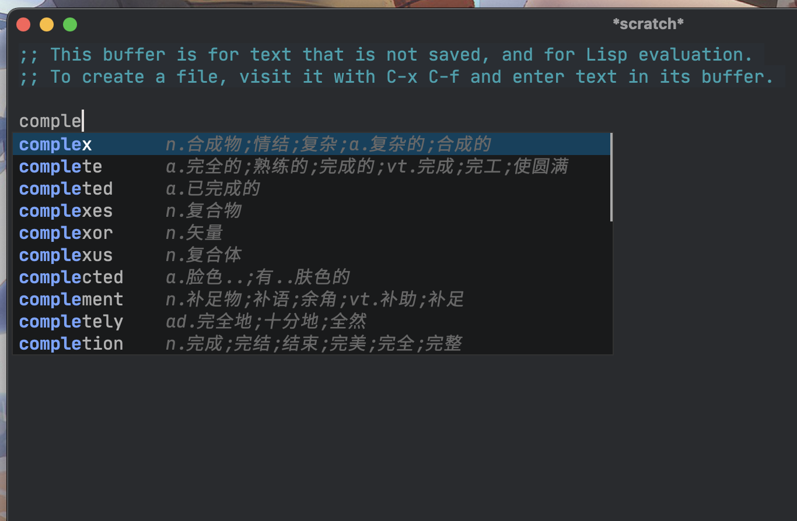

> 由于 `GoLand` 在 `M1` 的笔记本外接显示器上会屏幕闪烁, 所以重拾 `Emacs`. 记录这次配置 `Emacs` 的一些坑.

# 中文字体

如果没有配置等宽等高的中文字体, 会在同时显示中英文的时候出现屏幕跳动, 补全的 `childframe` 显示错位之类的问题, 个人由于 `GoLand` 字体看习惯了, 所以依然使用 `JetBrainsMono` 作为应为字体, 中文字体选用 [更莎黑体](https://github.com/be5invis/Sarasa-Gothic).

显示效果如图:



```lisp
(defun +my/better-font()
  (interactive)
  ;; english font
  (if (display-graphic-p)
      (progn
        (set-face-attribute 'default nil :font (format "%s:pixelsize=%d" "JetBrainsMono NF" 15))
        ;; chinese font
        (dolist (charset '(kana han symbol cjk-misc bopomofo))
          (set-fontset-font (frame-parameter nil 'font)
                            charset
                            (font-spec :family "Sarasa Mono SC"))))
    ))
(defun +my|init-font(frame)
  (with-selected-frame frame
    (if (display-graphic-p)
        (+my/better-font))))
(add-hook 'after-make-frame-functions #'+my|init-font)
(+my/better-font)
```

# Environment

个人使用了 [Emacs Plus](https://github.com/d12frosted/homebrew-emacs-plus) 进行编译的, 会读取 `login shell` 中的 `PATH` 环境变量, 如 `.zprofile` `.profile` 文件中配置的环境变量, 但是其它的环境变量实测没有主动获取, 所以不得已还是选择使用 `exec-path-from-shell` 获取需要用到的环境变量.

```lisp
(if is-darwin
    (use-package exec-path-from-shell
      :defer 1
      :straight t
      :config
      (setq exec-path-from-shell-variables '("PATH" "PYTHONPATH" "GOPATH" "GTAGSOBJDIRPREFIX" "GTAGSCONF" "GTAGSLABEL"))
      (setq exec-path-from-shell-check-startup-files nil)
      (setq exec-path-from-shell-arguments '("-l"))
      (exec-path-from-shell-initialize))
      
    (setq dired-use-ls-dired nil) ;; 不设置该行的话会在使用dired的时候报错.
    )
```

# Project

自带的 `project.el` 包使用了系统默认的 `grep` 和 `find` 分别作为全局查找和文件查找的工具, 这两个工具不如 `ripgrep` 和 `fd` 好用. `ripgrep` 和 `fd` 会从 `.gitignore` 中读取不需要搜索的文件, 所以以下配置可以修改默认 `project.el` 的行为.

```lisp
(use-package project
  :straight t
  :bind (("C-c p p" . project-switch-project)
         ("C-c p f" . project-find-file)
         ("C-c p g" . project-find-regexp)
         ("C-c p b" . consult-project-buffer)
         ("C-c p s" . magit-project-status))
  :init
  (setq project-list-file (expand-file-name "projects" prelude-local-dir))
  :config
  (defcustom project-root-markers
    '("Cargo.toml" "go.mod" "package.json" ".git")
    "Files or directories that indicate the root of a project."
    :type '(repeat string)
    :group 'project)
  (defun project-root-p (path)
    "Check if the current PATH has any of the project root markers."
    (catch 'found
      (dolist (marker project-root-markers)
        (when (file-exists-p (concat path marker))
          (throw 'found marker)))))
  (defun project-find-root (path)
    "Search up the PATH for `project-root-markers'."
    (let ((path (expand-file-name path)))
      (catch 'found
        (while (not (equal "/" path))
          (if (not (project-root-p path))
              (setq path (file-name-directory (directory-file-name path)))
            (throw 'found (cons 'transient path)))))))
  (add-to-list 'project-find-functions #'project-find-root)
  (defun my/project-files-in-directory (dir)
    "Use `fd' to list files in DIR."
    (let* ((default-directory dir)
           (localdir (file-local-name (expand-file-name dir)))
           (command (format "fd -H -t f -0 -E .git . %s" localdir)))
      (project--remote-file-names
       (sort (split-string (shell-command-to-string command) "\0" t)
             #'string<))))

  (cl-defmethod project-files ((project (head transient)) &optional dirs)
    "Override `project-files' to use `fd' in local projects."
    (mapcan #'my/project-files-in-directory
            (or dirs (list (project-root project)))))
  (setq magit-bind-magit-project-status nil)
  (define-key project-prefix-map "v" #'vterm)
  (define-key project-prefix-map "m" #'magit-project-status)
  (setq project-switch-commands
        '((project-find-file "Find file")
          (project-find-regexp "Find ripgrep")
          (project-find-dir "Find directory")
          (vterm "VTerm")
          (magit-project-status "Magit")))
  )

(setq xref-search-program 'ripgrep)
```

# Buffer

`switch-to-next-buffer` 和 `switch-to-prev-buffer` 可以通过 `switch-to-prev-buffer-skip` 设置的函数进行过滤跳转, 大部分时候切换 `buffer` 是希望在项目中的文件进行切换, 并不想切换到 `emacs` 的一些包的 `log` `buffer`, 所以可以通过设置 `boring-buffer-p` 来决定哪些 `buffer` 是不想通过快捷键切出来的.

```lisp
(defun project-buffer-p (buf)
  (member (buffer-name buf)
          (let ((buffers ()))
            (dolist (pr (project-buffers (project-current)))
              (push (buffer-name pr) buffers))
            buffers)))

(defun vmacs-boring-buffer-p(&optional buf)
  (string-match-p (rx (or
                       "\*Async-native-compile-log\*"
                       "magit"
                       "\*company-documentation\*"
                       "\*eaf" "\*eldoc" "\*Launch " "*dap-"
                       "*EGLOT " "\*Flymake log\*"
                       "\*gopls::stderr\*" "\*gopls\*"
                       "\*Compile-Log\*" "*Backtrace*"
                       "*Package-Lint*" "\*sdcv\*" "\*tramp"
                       "\*lsp-log\*" "\*tramp" "\*Ibuffer\*"
                       "\*Help\*" "\*ccls" "\*vc"
                       "\*xref" "\*Warnings*" "\*Http"
                       "\*Async Shell Command\*"
                       "\*Shell Command Output\*"
                       "\*Calculator\*" "\*Calc "
                       "\*Flycheck error messages\*"
                       "\*Gofmt Errors\*"
                       "\*Ediff" "\*sdcv\*"
                       "\*Org PDF LaTex Output\*"
                       "\*Org Export"
                       "\*osx-dictionary\*" "\*Messages\*"
                       "\*straight-process\*"
                       ))
                  (buffer-name buf)))

(defun vmacs-tab-vterm-p(&optional buf)
  (eq (buffer-local-value 'major-mode (or buf (current-buffer))) 'vterm-mode))

;; switch-to-prev-buffer 与 switch-to-next-buffer 时 skip 特定的buffers
;;而 tab-line-switch-to-prev/next-tab 恰好使用了上面两个函数
(defun vmacs-switch-to-prev-buffer-skip(win buf bury-or-kill)
  (when (member this-command '(next-buffer previous-buffer
                                           switch-to-prev-buffer
                                           switch-to-next-buffer))
    (cond
     ;; ((vmacs-tab-vterm-p)                ;当前buffer是vterm
     ;; (not (vmacs-tab-vterm-p buf)))     ;若buf 不是vterm,则skip
     ((vmacs-boring-buffer-p (current-buffer))
      (not (vmacs-boring-buffer-p buf)))
     (t                                 ;当前buffer是正常buffer
      (or (vmacs-boring-buffer-p buf)   ;若buf 是boring buf 或vterm，则跳过
          (vmacs-tab-vterm-p buf)
          (not (project-buffer-p buf))
          )))))

(setq switch-to-prev-buffer-skip #'vmacs-switch-to-prev-buffer-skip)

```
