>  本译文译自 [Peeking inside a Rust enum](https://fasterthanli.me/articles/peeking-inside-a-rust-enum)

---


<style>
.dialog {
    display: flex;
    flex-direction: row;
    padding-bottom: 1em;
    overflow: hidden;
}
.dialog p {
    color: black;
}
.dialog a {
    color: #0366d6;
    
}
.dialog.amos {
    flex-direction: row-reverse;
}
.dialog-head {
    align-self: flex-start;
    flex-basis: 48px;
    width: 48px;
    height: 48px;
    margin: 0.2em 0.4em;
    flex-shrink: 0;
}
.dialog-text {
    background-color: #fefdf6;
    border: 1px solid #ffeb81;
    max-width: 600px;
    align-self: flex-start;
    border-radius: 3px;
    padding: 0.4rem 0.8rem;
    overflow: hidden
}
.dialog.amos .dialog-text {
    background-color: #f6f9ff;
    border: 1px solid #cce3f9;
}
.tip {
    line-height: 1.6;
    border-radius: 4px;
    padding: 0.4rem 0.8rem;
    background-color: #fefdf6;
    border: 1px solid #ffeb81;
}
.tip .tip-header {
    display: flex;
    align-items: center;
    justify-content: center;
    font-weight: bold;
    margin-top: 0.2em;
    margin-bottom:0.6em;
}
.tip .tip-header img {
    transform: none;
    width: 3rem;
    height: 3rem;
}
</style>
# 前言

在我最近 `Rust Q&A` `twitch` 频道里, 有些人提出了一个看起来简单的问题: 为什么 `small string` 类型, 像 `SmartString` or `SmolStr` 和 `String` 有着一样的大小, 但是 `small vec` 类型, 像 `SmallVec` 却要比 `Vec` 大?

我知道我使用了简单作为形容词, 但是事实上要了解这个问题, 我们需要一些背景知识

> 译者: 亿点点...

## 这个问题到底是什么?

我最近谈到 `Rust` [small string crates](https://fasterthanli.me/articles/small-strings-in-rust).

被这些 `crates` 导出的类型可以避免多次内存分配, 并且降低内存使用量. 让我们看一个 [smartstring](https://lib.rs/crates/smartstring) 的代码作为例子.

```rust
use smartstring::{Compact, SmartString};
use std::mem::size_of_val;

fn main() {
    let smart = SmartString::<Compact>::from("hello world");
    dbg!(size_of_val(&smart));
    let stand = String::from("hello world");
    dbg!(size_of_val(&stand));
}
```

```shell
$ cargo run -q
[src/main.rs:6] size_of_val(&smart) = 24
[src/main.rs:9] size_of_val(&stand) = 24
```

正如你看到的, 同样也是最初的问题描述的那样, 这两个类型的大小是相同的.

<div class="dialog">
    
    <div class="dialog-text">
    <p>毫无疑问的, `String` 存储实际数据是在别的地方? 因为所有 `String` 类型值的大小在64位平台上都是24个字节.</p>
    </div>
</div>


是的, 这当然不是一个完整的故事, 在这个特别的例子中, `smart` 以 `inline` 的方式存储它的值(在栈上), 而标准库将值存储在堆上:


如果我们想知道每个类型到底总共使用了多少内存, 我们可以这样做:

```rust
    let smart = SmartString::<Compact>::from("hello world");
    dbg!(size_of_val(&smart));

    let stand = String::from("hello world");
    dbg!(size_of_val(&stand) + stand.capacity());
```

```shell
$ cargo run -q
[src/main.rs:6] size_of_val(&smart) = 24
[src/main.rs:9] size_of_val(&stand) + stand.capacity() = 35
```

<div class="dialog">
    
    <div class="dialog-text">
        <p>好吧, 但是 - 你说 <code>String</code> 显而易见在堆中存放它的内容. 有什么方法可以正式这个说法么?
        </p>
    </div>
</div>

<div class="dialog amos">
    
    <div class="dialog-text">
        <p>当然有!</p>
    </div>
</div>

典型的, 在 `Linux 64-bit` 系统中栈和堆在虚拟地址中的空间相差很远, 这意味着我们如果打印字符串的元数据的地址和内容的地址, 我们就可以看到:
* `SmartString` 的元数据和内容在相邻的位置.
* `String` 的元数据和内容相距很远.

```rust
use smartstring::{Compact, SmartString};

fn main() {
    let smart = SmartString::<Compact>::from("hello world");
    let smart_meta = &smart as *const _;
    let smart_data = &smart.as_bytes()[0] as *const _;
    dbg!((smart_meta, smart_data));

    let stand = String::from("hello world");
    let stand_meta = &stand as *const _;
    let stand_data = &stand.as_bytes()[0] as *const _;
    dbg!((stand_meta, stand_data));
}
```

```shell
$ cargo run -q
[src/main.rs:7] (smart_meta, smart_data) = (
    0x00007ffce4cf4728,
    0x00007ffce4cf4729,
)
[src/main.rs:12] (stand_meta, stand_data) = (
    0x00007ffce4cf47f8,
    0x0000555f87686a60,
)
```


<div class="dialog">
    
    <div class="dialog-text">
        <p>好吧, 我信了. 那么 <code>smart</code> 总是把它的数据存储在栈中吗?</p>
    </div>
</div>

不! 只有在小于24字节的时候是存储在栈上的, 就和 `String` 一样. 我们用稍微长一点的字符串来看看.

```rust
use smartstring::{Compact, SmartString};

fn main() {
    let input = "Turns out you can blame your tools *and* be a good craftsperson. Who knew?";

    let smart = SmartString::<Compact>::from(input);
    let smart_meta = &smart as *const _;
    let smart_data = &smart.as_bytes()[0] as *const _;
    dbg!((smart_meta, smart_data));

    let stand = String::from(input);
    let stand_meta = &stand as *const _;
    let stand_data = &stand.as_bytes()[0] as *const _;
    dbg!((stand_meta, stand_data));
}
```

```shell
$ cargo run -q
[src/main.rs:9] (smart_meta, smart_data) = (
    0x00007ffd460d0268,
    0x0000555f4636ca30,
)
[src/main.rs:14] (stand_meta, stand_data) = (
    0x00007ffd460d0338,
    0x0000555f4636cac0,
)
```

...然后我们就可以看到这两个类型的内容现在都放在堆上了.

<div class="dialog">
    
    <div class="dialog-text">
        <p>这样, 那 <code>SmartString</code> 是否意味着买一送一的处理方式? 这和他的类型有关?</p>
        <br/>
        <p>它是怎么工作的?</p>
    </div>
</div>

<div class="dialog amos">
    
    <div class="dialog-text">
        <p>多么好的一个问题. 让我们谈谈枚举</p>
    </div>
</div>


## 一个单词, 多种意义

如果你有着 `C/C++/Java/C#` 的语言背景, 一个 `enum` 仅仅意味着一个 `Integer` 类型, 只是它的值有着自己的意义.

让我们看一个 `C` 的例子:

```c
#include <stdio.h>

enum Drink {
    Water,
    Soda,
    Juice,
};

int main() {
    enum Drink dri = Soda;
    printf("dri = %d\n", dri);
    printf("sizeof(dri) = %ld\n", sizeof(dri));
    printf("sizeof(int) = %ld\n", sizeof(int));
}
```

这里, 我们声明了一个枚举类型 `enum Drink`, 有三个变体, 不过仅仅是从0开始的数字, 所以我们有 `Water = 0`, `Soda = 1`, `Juice = 2`:

```shell
$ clang -Wall main.c -o main && ./main
dri = 1
sizeof(dri) = 4
sizeof(int) = 4
```

然而我不是很喜欢这个代码, 我不想要额外的限定词, 并且想要我的变体有着自己的命名空间, 但在 `C` 里面我们需要自己做这些事:

```c
#include <stdio.h>

// this could also be done in two separate declarations
typedef enum Drink {
    Drink_Water,
    Drink_Soda,
    Drink_Juice,
} Drink;

int main() {
    Drink dri = Drink_Soda;
    printf("dri = %d\n", dri);
    printf("sizeof(dri) = %ld\n", sizeof(dri));
    printf("sizeof(int) = %ld\n", sizeof(int));
}
```

Ahhh, 好多了. 但是这里仍然有其它的东西我不是特别喜欢, 像是 `C` 的 `switch`. 下面的代码是错误的:
```c
#include <stdio.h>

typedef enum Drink {
    Drink_Water,
    Drink_Soda,
    Drink_Juice,
} Drink;

void print_drink(Drink dri) {
    switch (dri) {
        case Drink_Water:
            printf("It's water!\n");
        case Drink_Soda:
            printf("It's soda!\n");
        case Drink_Juice:
            printf("It's juice!\n");
    }
}

int main() {
    print_drink(Drink_Soda);
}
```

正确的代码是在每个 `case` 语句的结尾都使用 `break`. 这是刚起步的开发人员很早就应该了解的事情之一.

<div class="tip">
    <div class="tip-header">
        
        Cool bear's hot tip
    </div>
    鹅妹子嘤, 在 `C#` 中是强制要求在每个非空的 <code>case</code> 中添加 <code>break</code> 否则不能编译通过, 这防止你硬编码错误而导致的隐式跌落(意思是没有 <code>break</code> 的情况就一个 <code>case</code> 一个 <code>case</code> 向下运行), 如果喜欢的话你仍然可以实现一个 <a href="https://stackoverflow.com/questions/174155/switch-statement-fallthrough-in-c/174223#174223">明确的跌落</a>.
</div>

即使我们修复了 `switch` 的问题, 还有件我不喜欢 `C` 枚举的事情, 那就是没什么可以阻止我传递一个无意义的值:

```c
#include <stdio.h>

typedef enum Drink {
    Drink_Water,
    Drink_Soda,
    Drink_Juice,
} Drink;

void print_drink(Drink dri) {
    switch (dri) {
        case Drink_Water:
            printf("It's water!\n");
            break;
        case Drink_Soda:
            printf("It's soda!\n");
            break;
        case Drink_Juice:
            printf("It's juice!\n");
            break;
    }
}

int main() {
    print_drink(47);
}
```

```shell
$ clang -Wall main.c -o main && ./main
```

现在, 如果我们看看 `Rust` 的枚举... 这是个完全不同的事情.

让我们尽量写一个相同的程序.

```rust
use std::mem::size_of_val;

enum Drink {
    Water,
    Soda,
    Juice,
}

fn main() {
    let dri = Drink::Water;
    dbg!(size_of_val(&dri));
    dbg!(dri as u32);
}
```

```shell
$ cargo run -q
warning: variant is never constructed: `Soda`
 --> src/main.rs:5:5
  |
5 |     Soda,
  |     ^^^^
  |
  = note: `#[warn(dead_code)]` on by default

warning: variant is never constructed: `Juice`
 --> src/main.rs:6:5
  |
6 |     Juice,
  |     ^^^^^

warning: 2 warnings emitted

[src/main.rs:11] size_of_val(&dri) = 1
[src/main.rs:12] dri as u32 = 0
```

那么我们明显地得到了什么好处呢?


<div class="dialog">
    
    <div class="dialog-text">
        <p>让我看看, 这看起来像是一个 <code>Integer</code> 类型 - 至少, 我能把它转型为一个 <code>u32</code>. 但是它默认就有命名空间?</p>
    </div>
</div>

对的, 但那并不是全部! 编译器警告我们有没有使用的变体, 并且我们可以简单地给这个枚举派生一个 `Debug` trait 的实现:

```rust
#[derive(Debug)]
enum Drink {
    Water,
    Soda,
    Juice,
}

fn main() {
    print_drink(&Drink::Water);
    print_drink(&Drink::Juice);
    print_drink(&Drink::Soda);
}

fn print_drink(dri: &Drink) {
    println!("{:?}", dri);
}
```

```shell
$ cargo run -q
Water
Juice
Soda
```

...并且假如我们不那么做, 我们也能使用 `match` 而不是 `switch`, `match` 会检查是否匹配了枚举的所有变体, 举个例子, 下面的代码不能通过编译:

```rust
fn print_drink(dri: &Drink) {
    match dri {
        Drink::Water => println!("it's water!"),
        Drink::Soda => println!("it's soda!"),
    }
}
```

```shell
$ cargo run -q
error[E0004]: non-exhaustive patterns: `&Juice` not covered
  --> src/main.rs:15:11
   |
2  | / enum Drink {
3  | |     Water,
4  | |     Soda,
5  | |     Juice,
   | |     ----- not covered
6  | | }
   | |_- `Drink` defined here
...
15 |       match dri {
   |             ^^^ pattern `&Juice` not covered
   |
   = help: ensure that all possible cases are being handled, possibly by adding wildcards or more match arms
   = note: the matched value is of type `&Drink`
```

编译器给出了两种可能的方法来修复这个问题, 或是添加一个通配符:

```rust
fn print_drink(dri: &Drink) {
    match dri {
        Drink::Water => println!("it's water!"),
        Drink::Soda => println!("it's soda!"),
        _ => println!("it's something we don't know about!"),
    }
}
```

或者是覆盖到所有的情况:

```rust
fn print_drink(dri: &Drink) {
    match dri {
        Drink::Water => println!("it's water!"),
        Drink::Soda => println!("it's soda!"),
        Drink::Juice => println!("it's juice!"),
    }
}
```

<div class="tip">
    <div class="tip-header">
        
        Cool bear's hot tip
    </div>
    这听起来是不是要敲很多代码? 幸运的是, <code>rust-analyzer</code> 可以帮忙补全 <code>case</code>, 这帮我们自动生成的很大一部分代码.
</div>

讲到 `match`, 它也是一个表达式, 所以我们也可以这么做:

```rust
fn print_drink(dri: &Drink) {
    println!(
        "{}",
        match dri {
            Drink::Water => "it's water!",
            Drink::Soda => "it's soda!",
            Drink::Juice => "it's juice!",
        }
    )
}
```

尽管就我个人而言, 我可能更倾向于这样写:

```rust
fn print_drink(dri: &Drink) {
    let name = match dri {
        Drink::Water => "water",
        Drink::Soda => "soda",
        Drink::Juice => "juice",
    };
    println!("it's {}!", name)
}
```

让我们想想, 我们还抱怨了 `C` 枚举的什么地方?

<div class="dialog">
    
    <div class="dialog-text">
        <p>你可以传递无意义的值!</p>
    </div>
</div>

对! 让我们试试:

```rust
fn main() {
    print_drink(&Drink::Water);
    print_drink(&Drink::Juice);
    print_drink(&Drink::Soda);

    let val: Drink = 4 as Drink;
    print_drink(&val);
}
```

```shell
$ cargo run -q
error[E0605]: non-primitive cast: `i32` as `Drink`
  --> src/main.rs:13:22
   |
13 |     let val: Drink = 4 as Drink;
   |                      ^^^^^^^^^^
   |
   = note: an `as` expression can only be used to convert between primitive types. Consider using the `From` traitt
```

Ah, 这看起来并不能工作! 然而在某些情形中我们可能需要这么做, 我们可以解析一个二进制格式, 并且已经确保检查这个数字类型的值在这个枚举中是有意义的 - 那么我们可以使用 `transmute`:

```rust
#[allow(dead_code)]
enum Drink {
    Water,
    Soda,
    Juice,
}

fn main() {
    let juice_from_binary_format = 2;

    let val: Drink = unsafe { std::mem::transmute(juice_from_binary_format as u8) };
    print_drink(&val);
}

fn print_drink(dri: &Drink) {
    let name = match dri {
        Drink::Water => "water",
        Drink::Soda => "soda",
        Drink::Juice => "juice",
    };
    println!("it's {}!", name)
}
```

```shell
$ cargo run -q
it\'s juice!
```

当前, 通常我们希望给这个不安全操作提供一个安全的接口:

```rust
use std::convert::{TryFrom, TryInto};

#[allow(dead_code)]
enum Drink {
    Water,
    Soda,
    Juice,
}

impl TryFrom<i32> for Drink {
    type Error = &'static str;

    fn try_from(x: i32) -> Result<Self, Self::Error> {
        match x {
            0..=2 => Ok(unsafe { std::mem::transmute(x as u8) }),
            _ => Err("invalid Drink value"),
        }
    }
}

fn main() {
    let juice_from_binary_format: i32 = 2;
    let val: Drink = juice_from_binary_format.try_into().unwrap();
    print_drink(&val);

    let invalid_value: i32 = 4;
    let val: Drink = invalid_value.try_into().unwrap();
    print_drink(&val);
}
```

```shell
$ cargo run -q
it\'s juice!
thread 'main' panicked at 'called `Result::unwrap()` on an `Err` value: "invalid Drink value"', src/main.rs:27:22
note: run with `RUST_BACKTRACE=1` environment variable to display a backtrace
```

并且我们的快乐还并不止步于此.

还记得我们之前打印我们的枚举大小么? 让我们来 [refresh out memory](https://en.wikipedia.org/wiki/Memory_refresh):

```rust
use std::mem::size_of;

#[allow(dead_code)]
enum Drink {
    Water,
    Soda,
    Juice,
}

fn main() {
    dbg!(size_of::<Drink>());
}
```

```shell
$ cargo run -q
[src/main.rs:11] size_of::<Drink>() = 1
```

单位是字节, 所以这里显示我们的枚举只有一个字节.

让我们与 `C` 的对比下:

```c
#include <stdio.h>

typedef enum Drink {
    Drink_Water,
    Drink_Soda,
    Drink_Juice,
} Drink;

int main() {
    printf("sizeof(Drink) = %ld\n", sizeof(Drink));
}
```

```shell
$ clang -Wall main.c -o main && ./main
sizeof(Drink) = 4
```

这里枚举有足足4个字节, 所以我们可以近似地说 `Rust` 的枚举是 `u8`, `C` 枚举是 `u32`.

如果 `Rust` 的枚举超过256个变体呢?

```rust
use std::mem::size_of;

#[allow(dead_code)]
enum Drink {
    Variant0,
    Variant1,
    Variant2,
    Variant3,
    Variant4,
    // (etc.)
    Variant252,
    Variant253,
    Variant254,
    Variant255,
    Variant256,
}

fn main() {
    dbg!(size_of::<Drink>());
}
```

<div class="dialog">
    
    <div class="dialog-text">
        <p>等等, 这里只有256个变体?</p>
    </div>
</div>

<div class="dialog amos">
    
    <div class="dialog-text">
        <p>Nice try cool bear, but no! <a href="https://en.wikipedia.org/wiki/Off-by-one_error#Fencepost_error">你只是在数栅栏中的格子, 你应该数标杆</a>.</p>
    </div>
</div>

> 译者: [counting the fences, when you should be counting the posts.](https://en.wikipedia.org/wiki/Off-by-one_error#Fencepost_error)

不管怎样, 我们先看看现在的枚举大小?

```shell
$ cargo run -q
[src/main.rs:265] size_of::<Drink>() = 2
```

2个字节! 看起来又像是 `u16`.

当然看起来像并不是一个专业术语 - 专业术语应该是 "representation". 一个 `Rust` 枚举是对特定整数类型的抽象.

让我们看看我们原来的 `Drink`:

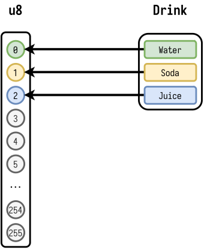

概念上, `Drink` 只有三个有意义的值, 但是它的表现是一个 `u8`, 能持有256个不同的值. 这就是你为什么总是能把 `Drink` 转为 `u8`, 但是把 `u8` 转为 `Drink` 却是一个容易出错的操作.

<div class="dialog">
    
    <div class="dialog-text">
        <p>因此使用 <code>TryFrom/TryInto</code> 而不是 <code>From/Into</code></p>
    </div>
</div>

对的! 潜在的 `Drink` 作为一个 `u8` 应该总是为0, 1或者2, 这被称为不变体(invariant). 如果我们破坏了这个不变体, 我们的代码就不是那么健壮了.

在 `Rust`, 破坏不变体需要使用 `unsafe` 代码:

```rust
use std::mem::transmute;

#[allow(dead_code)]
#[derive(Debug, PartialEq)]
enum Drink {
    Water,
    Soda,
    Juice,
}

fn main() {
    // woops! that's unsound.
    let d: Drink = unsafe { transmute(15_u8) };
    dbg!(&d);
    dbg!(d == Drink::Juice);
}
```

```shell
$ cargo run -q
[src/main.rs:14] &d = Juice
[src/main.rs:15] d == Drink::Juice = false
```

<div class="dialog">
    
    <div class="dialog-text">
        <p>这太糟了 - 但是你没法意外的通过安全代码来获取一个无效的枚举值不是吗?</p>
    </div>
</div>

<div class="dialog amos">
    
    <div class="dialog-text">
        <p>对的, <code>unsafe</code>关键字将一个区域标记为更少的约束, 所以在代码审查中要对有潜在危险的代码格外注意.</p>
    </div>
</div>

<div class="dialog">
    
    <div class="dialog-text">
        <p>听起来很糟. 是不是意味着有 <code>unsafe</code> 的代码就很糟糕呢?</p>
    </div>
</div>

<div class="dialog amos">
    
    <div class="dialog-text">
        <p>有时候是不可避免的. 但是仅仅是有时候! 库作者通常会发现他们并不是真的需要 <code>unsafe</code> 来做他们想做的事情, 他们可以把那些替换成安全的代码 - 这使得只有更少的区域需要去重点关注.</p>
    </div>
</div>

<div class="dialog">
    
    <div class="dialog-text">
        <p>不能使语言本身完全没有 <code>unsafe</code> 代码吗?</p>
    </div>
</div>

<div class="dialog amos">
    
    <div class="dialog-text">
        <p>完全不要 <code>unsafe</code> 代码是一个比较大的话题, 但是当然需要更少的不安全代码. 举个例子, 有一个为了 <a href="https://github.com/rust-lang/project-safe-transmute">safe(r) transmute</a> 的工作小组.</p>
    </div>
</div>

问题的关键在于不是所有的事情都可以交由计算机去做(意味着需要你自己去做), 可以使用 `Rust` 的模型检查. 因为种种原因, 你仍然需要 `unsafe` 代码.

这并不意味有着两种 `Rust`, 仅仅意味着不同的风险以及不同的可信任等级.

如果你相信 `Rust` 核心团队可以根除标准库中的不健全之处, 那么你甚至就可以让团队中的初级人员在此基础上编写受 `Rust` 安全保证的 `safe code`.

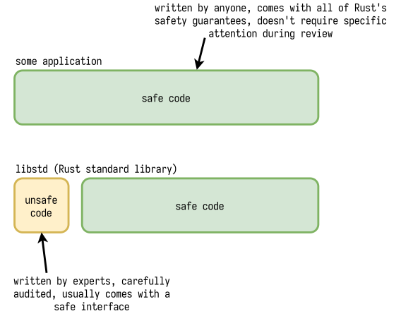

## Rust枚举不止于此

Cool bear早先说 `SmartString` 有着买一送一的处理字符串的方式. Cool bear是对的!

让我们来自己做一个 `two-for-one` 的处理方式:

```rust
enum UserID {
    Number(u64),
    Text(String),
}
```

`UserID` 是一个聚合类型, 一个 `UserID` 的值可以是一个 `UserID::Number` 变体, 或是一个 `UserID::Text` 变体.如果我们想对它的内容做些操作, 我们需要用模式匹配:

```rust
fn print_user_id(id: &UserID) {
    match id {
        UserID::Number(n) => {
            println!("user id number {}", n);
        }
        UserID::Text(s) => println!("user id {}", s),
    }
}
```

希望你对这个用法很熟悉, 我们在不久前刚提到过这个用法.

让我们进行一次打印操作:

```rust
fn main() {
    print_user_id(&UserID::Number(79));
    print_user_id(&UserID::Text("fh99a73gbh8".into()));
}
```

```shell
$ cargo run -q
user id number 79
user id fh99a73gbh8
```

我们在这文章之前看到过另一个聚合类型, 然后我们实现 `TryInto`, 我们会返回 `Result<T, E>`:

```rust
impl TryFrom<i32> for Drink {
    type Error = &'static str;

    fn try_from(x: i32) -> Result<Self, Self::Error> {
        // omitted
    }
}
```

`Result` 值是一个枚举, 它实际是这样定义的:

```rust
pub enum Result<T, E> {
    /// Contains the success value
    Ok(T),
    /// Contains the error value
    Err(E),
}
```

让我们返回看我们的 `UserID` 枚举:

```rust
enum UserID {
    Number(u64),
    Text(String),
}
```

它的大小是多少呢? 如果我们尝试在 `C` 里模拟实现一个 `Rust` 的枚举, 它将会看起来如下:

```c
#include <stdint.h>
#include <stdio.h>

enum UserIDKind {
    UserIDKind_Number,
    UserIDKind_Text,
};

struct UserID {
    enum UserIDKind kind;
    uint64_t number;
    char *text;
};
```

尽管我们只需要两个变体, 但我们需要三个属性, 以让我们知道我们现在处理的是哪一个变体.

举个例子, 在 `print_user_id`, 我们应该使用 `switch` 来处理我们使用的是 `Number` 变体还是 `Text` 变体:

```c
void print_user_id(struct UserID* id) {
    switch (id->kind) {
        case UserIDKind_Number:
            printf("user id number %lu\n", id->number);
            break;
        case UserIDKind_Text:
            printf("user id %s\n", id->text);
            break;
    }
}
```

并且当我们初始化 `UserID` 结构体的时候, 我们仅需要初始化我们需要的属性, 并且设置它的 `kind`:

```c
int main() {
    struct UserID a = {
        .kind = UserIDKind_Number,
        .number = 79,
    };
    print_user_id(&a);

    struct UserID b = {
        .kind = UserIDKind_Text,
        .text = "fh99a73gbh8",
    };
    print_user_id(&b);
}
```

这是可以工作的:

```shell
$ clang -Wall main.c -o main && ./main
user id number 79
user id fh99a73gbh8
```

但这并不理想, 这并没有像 `Rust` 那样的安全保证, 我们无法阻止你创建一个 `Text` 而 `kind` 是一个 `Number`:

```c
int main() {
    struct UserID woops = {
        .kind = UserIDKind_Number,
        .text = "woops",
    };
    print_user_id(&woops);
}
```

```shell
$ clang -Wall main.c -o main && ./main
user id number 0
```

我们实现了一个不完善的抽象 - 我们可以直接访问它的底层表示, 并且以不合理的方式操作它.

举个例子, 如果我们的 `UserID` 是使用 `malloc` 在堆上分配的并且也没有清零, 那会发生什么?

```c
#include <stdlib.h>

int main() {
    struct UserID *woops = malloc(sizeof(struct UserID));
    woops->kind = UserIDKind_Text;
    woops->number = 79;
    print_user_id(woops);
}
```

在debug模式编译下, 它不会很糟糕:

```shell
$ clang -Wall main.c -o main && ./main
user id (null)
```

然而在release模式编译下, 随着优化的打开, 将会发生很有趣的现象:

```shell
$ clang -O3 -Wall main.c -o main && ./main
user id }
$ clang -O3 -Wall main.c -o main && ./main
user id 
$ clang -O3 -Wall main.c -o main && ./main
user id m
```

从哪里来的? 谁知道呢. 但是它没有导致段错误 - 这意味着它从程序的其他部分读取数据. 在一个大型程序中, 那可能是用户的隐私数据, 而这个漏洞就可能被用来窃取隐私数据.

不过这并不是一篇讲 `C` 有多危险的文章,

<div class="dialog">
    
    <div class="dialog-text">
        <p>...你一直在讲</p>
    </div>
</div>

...emmm, 让我们看看还有什么不好的地方.

首先让我们看看我们 `struct UserID` 的大小:

```shell
$ clang -Wall main.c -o main && ./main
sizeof(struct UserID) = 24
```

24字节. 这只是一个结构体, 所以我们可以自己计算出来:

```c
int main() {
    printf("sizeof(struct UserID) = %ld\n", sizeof(struct UserID));
    printf("%ld + %ld + %ld = %ld\n",
        sizeof(enum UserIDKind), sizeof(uint64_t), sizeof(char *),
        sizeof(enum UserIDKind) + sizeof(uint64_t) + sizeof(char *)
    );
}
```

```shell
$ clang -Wall main.c -o main && ./main
sizeof(struct UserID) = 24
4 + 8 + 8 = 20
```

Oh, woops. 我们哪里做错了?

淡定, 这是因为在 `kind` 和 `number` 之间有 `padding`, 以使我们的属性是64位对齐的(后面会详细说明).

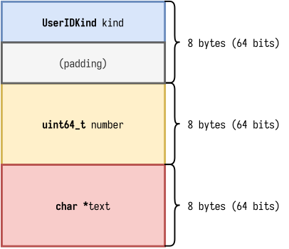

这就是为什么我们的 `UserID` 结构体是3*8=24个字节.

当前, 我们可以命令编译器不要做对齐, 然后在计算一次:

```c
struct __attribute__((packed)) UserID {
    enum UserIDKind kind;
    uint64_t number;
    char *text;
};
```

```shell
$ clang -Wall main.c -o main && ./main
sizeof(struct UserID) = 20
4 + 8 + 8 = 20
```

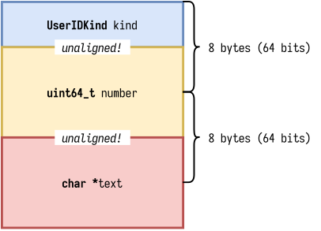

现在让我们看看 `Rust` 中 `UserID` 枚举的大小:

```rust
use std::mem::size_of;

#[allow(dead_code)]
enum UserID {
    Number(u64),
    Text(String),
}

fn main() {
    dbg!(size_of::<UserID>());
}
```

```shell
$ cargo run -q
[src/main.rs:10] size_of::<UserID>() = 32
```

Oh, uh, 这太大了. 太大了. 我不认为 `Rust` 的 `String` 类型只是一个单纯的指向空字符结尾的指针(c-style). 我认为 [it's a little more involved](https://fasterthanli.me/articles/working-with-strings-in-rust).

```rust
use std::{mem::size_of, os::raw::c_char};

#[allow(dead_code)]
enum UserID {
    Number(u64),
    Text(*const c_char),
}

fn main() {
    dbg!(size_of::<UserID>());
}
```

```shell
$ cargo run -q
[src/main.rs:10] size_of::<UserID>() = 16
```

Ok, 这看起来合理多了. 并且比 `C` 版本要小很多. 这里是为什么呢?

首先, 这里必须有一个等同于上面写的 `C` 语言的 `kind` 一样作用的东西. 在 `Rust` 中, 它叫做 `discriminant`(判别符). 这是一个 "tagged unions" 中的 "tag".

<div class="dialog">
    
    <div class="dialog-text">
        <p>欢迎来到计算机世界, 这里每个东西都有至少三个名字.</p>
    </div>
</div>

......我猜它应该是通过重叠 `*const c_char` 和 `u64` 来节省空间, 因为它们只能有一个是有效的, 不能同时存在: 这也是为什么称他们为 "disjoint union".

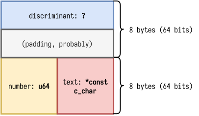

所以总共只有16个字节.

我们能做相同的事情在 `C` 里面吗? 这当然可以! `union` 关键字就是起着类似作用的. 这就像是一个结构体, 只是所有内容的内存地址是重叠的, 它的大小是它内部最大的那一个 (或多或少依然是需要考虑对齐的).

```c
struct UserID {
    enum UserIDKind kind;
    union {
        uint64_t number;
        char *text;
    };
};

int main() {
    printf("sizeof(struct UserID) = %ld\n", sizeof(struct UserID));
}
```

```shell
$ clang -Wall main.c -o main && ./main
sizeof(struct UserID) = 16
```

我们得到了与 `Rust` 相同的结果.

进一步的, 我们可以把 `UserIDKind` 改成一个 `uint8_t`(在64位计算机, `clang 10`作为编译器的情况下它是4个字节):

```c
struct UserID {
    uint8_t kind;
    union {
        uint64_t number;
        char *text;
    };
};
```

```shell
$ clang -Wall main.c -o main && ./main
sizeof(struct UserID) = 16;
```

Mhhhh好像没发生什么变化...

<div class="dialog">
    
    <div class="dialog-text">
        <p>像膨化食品包装一样 - 可能大部分都是填充物.</p>
    </div>
</div>

对的, 让我们再次 `packing` 我们的结构体:

```c
struct __attribute__((packed)) UserID {
    uint8_t kind;
    union {
        uint64_t number;
        char *text;
    };
};
```

```shell
$ clang -Wall main.c -o main && ./main
sizeof(struct UserID) = 9
```

只有9个字节了! 现在它压缩了.

我们可以在 `Rust` 中做类似的事情吗? `Rust` 默认是以属性做适应性对齐的, 如果我们有一个 `u8` and `u64`:

```rust
struct Foo {
    bar: u8,
    baz: u64,
}

fn main() {
    dbg!(size_of::<Foo>());
}
```

...它增长到了16个字节

```shell
$ cargo run -q
[src/main.rs:16] size_of::<Foo>() = 16
```

但是, 像 `C` 一样, 如果我们友好地要求, `Rust` 也可以 `pack`:

```rust
#[repr(packed)]
struct Foo {
    bar: u8,
    baz: u64,
}
```

```shell
$ cargo run -q
[src/main.rs:17] size_of::<Foo>() = 9
```

但是如果在枚举上呢?

```rust
#[repr(packed)]
enum UserID {
    Number(u64),
    Text(*const c_char),
}
```

```shell
$ cargo run -q
error[E0517]: attribute should be applied to struct or union
 --> src/main.rs:4:8
  |
4 |   #[repr(packed)]
  |          ^^^^^^
5 | / enum UserID {
6 | |     Number(u64),
7 | |     Text(*const c_char),
8 | | }
  | |_- not a struct or union
```

我们不能 `pack`. 这之前已经 [讨论](https://github.com/rust-lang/rust/issues/42547) 过了, 也有 [讨论其它奇异的枚举布局优化的方案](https://github.com/rust-lang/rfcs/issues/1230), 但是现在, 还不能那么做.

然而显然, `smartstring` 就是那么做的.

当一个 `SmartString` 存在堆里的时候(这是一个 `boxed` 变体), 它是24字节, 就像 `String` 一样.

但是如果我们尝试做一个我们自己的 `smartstring`, 使用 `Rust` 的枚举, 我们甚至无法接近它的大小:

```rust
use std::mem::size_of;

#[allow(dead_code)]
enum SmartString {
    Boxed(String),
    Inline([u8; 24]),
}

fn main() {
    dbg!(size_of::<String>());
    dbg!(size_of::<[u8; 24]>());
    dbg!(size_of::<SmartString>());
}
```

```shell
$ cargo run -q
[src/main.rs:10] size_of::<String>() = 24
[src/main.rs:11] size_of::<[u8; 24]>() = 24
[src/main.rs:12] size_of::<SmartString>() = 32
```

这里有件事是我们可以做的, 既然 `Rust` 不允许我们打包它的枚举, 那我们就做一个自己的枚举.

## 写一个自己的枚举

首先, 我们不能使用 [Rust unions](https://doc.rust-lang.org/reference/items/unions.html), 因为它只支持 `Copy` 和非 `Drop` 类型.

```rust
use std::mem::size_of;

#[allow(dead_code)]
#[repr(packed)]
struct SmartString {
    discriminant: u8,
    data: [u8; 24],
}

fn main() {
    dbg!(size_of::<SmartString>());
}
```

```shell
$ cargo run -q
[src/main.rs:11] size_of::<SmartString>() = 25
```

看! 25个字节. 这是我们目前最好的预想了.

但是实际上还没做任何事 - 我们只是存了25个字节在结构体里.

我们需要想出一个方法来保存我们的变体:

* boxed: a String
* inline: some utf-8 bytes, and I guess a length?

在 "inline" 变体时我们不能存大于24个字节的内容, 所以我们可以使用一个 `u8` 来表示长度, 实际像下面所示:

```rust
struct Inline {
    len: u8,
    data: [u8; 23],
}
```

然后, 为了确保我们这几个类型实际上有着相同的大小, 我们使用 [static_assertions](https://lib.rs/crates/static_assertions) crate:

```rust
use static_assertions::*;
use std::mem::size_of;

#[allow(dead_code)]
#[repr(packed)]
struct SmartString {
    discriminant: u8,
    data: [u8; 24],
}

#[allow(dead_code)]
struct Inline {
    len: u8,
    data: [u8; 23],
}

assert_eq_size!(String, Inline);

fn main() {
    dbg!(size_of::<SmartString>());
}
```

```shell
$ cargo check
    Finished dev [unoptimized + debuginfo] target(s) in 0.00s
```

Good, 要确保足够傻瓜, 因为我们将要写很多 `unsafe` 代码, 我们甚至能按照 `String` 的大小来定义我们的 `Inline`, 这个 "crate" 就可以帮忙检查我们的 `Inline` 和 `String` 大小相同.

```rust
use static_assertions::*;
use std::mem::size_of;

const VARIANT_SIZE: usize = std::mem::size_of::<String>();

#[allow(dead_code)]
#[repr(packed)]
struct SmartString {
    discriminant: u8,
    data: [u8; VARIANT_SIZE],
}

#[allow(dead_code)]
struct Inline {
    len: u8,
    data: [u8; VARIANT_SIZE - 1],
}

assert_eq_size!(String, Inline);

fn main() {
    dbg!(size_of::<SmartString>());
}
```

Okay, 现在让我们实现我们的手动枚举. 首先让它能够被构建.

我们仅使用了 `[u8; VARIANT_SIZE]` 来保留 `VARIANT_SIZE` 字节 - 如果我们真的想要往里面存一点东西, 我们将会用一个 `*mut` 指针指向它, 然后把它转型为我们所需要的:

```rust
impl SmartString {
    pub fn new_boxed(s: String) -> Self {
        Self::new(0, s)
    }

    pub fn new_inline() -> Self {
        Self::new(
            1,
            Inline {
                len: 0,
                data: Default::default(),
            },
        )
    }

    fn new<T>(discriminant: u8, data: T) -> Self {
        let mut res = Self {
            discriminant,
            data: Default::default(),
        };
        let ptr: *mut T = res.data.as_mut_ptr().cast();
        unsafe { ptr.write_unaligned(data) };
        res
    }
}
```

我们现在可以在我们的 `SmartString` 构建这两种变体:

```rust
fn main() {
    let boxed = SmartString::new_boxed("This is a longer string, would not fit inline".into());
    let inline = SmartString::new_inline();
}
```

除此之外我们目前也不能对它做其它事情了.

让我们把它变得有用点, 例如, 从它获取一个 `&str` 切片:

```rust
impl AsRef<str> for SmartString {
    fn as_ref(&self) -> &str {
        match self.discriminant {
            0 => {
                let s: *const ManuallyDrop<String> = self.data.as_ptr().cast();
                let tmp = unsafe { s.read_unaligned() };
                unsafe { &*(tmp.as_ref() as *const str) }
            }
            1 => {
                let s: *const Inline = self.data.as_ptr().cast();
                unsafe {
                    let slice = std::slice::from_raw_parts((*s).data.as_ptr(), (*s).len as _);
                    std::str::from_utf8_unchecked(slice)
                }
            }
            _ => unreachable!(),
        }
    }
}
```

还记得我之前说过的我们应该如何努力审查不安全代码以确保不会违反不变体, 在这里就比较适用. 我们使用了更安全的变体, `unreachable`, 但是如果我想冒险的话, 我会考虑使用 [unreachable_unchecked](https://doc.rust-lang.org/std/hint/fn.unreachable_unchecked.html).

> 译者: 审查指: 在这里我们把 `discriminant` 当作一个枚举或者说不变体 `match` 了, 因为它的值只有可能是0或者1以表示内容是 `inline` or `boxed`, 但是可能会有前文像 `C` 那样在开发过程中传递了非法的值而导致错误, 所以使用 `unreachable!` 宏来确保不会有这种情况出现, 在编译期就可以友好地提示开发者, 以使代码更加安全.

现在我们有了一个 `AsRef` 实现, 我们可以打印出它的实际内容了 - 而不需要在意实际上它的变体是什么(`Inline` or `Boxoed`).

方便起见, 我们实现 `Display` 和 `Debug`:

```rust
use std::fmt;

impl fmt::Display for SmartString {
    fn fmt(&self, f: &mut fmt::Formatter<'_>) -> fmt::Result {
        let s: &str = self.as_ref();
        fmt::Display::fmt(s, f)
    }
}

impl fmt::Debug for SmartString {
    fn fmt(&self, f: &mut fmt::Formatter<'_>) -> fmt::Result {
        let s: &str = self.as_ref();
        fmt::Debug::fmt(s, f)
    }
}

fn main() {
    let boxed = SmartString::new_boxed("This is a longer string, would not fit inline".into());
    let inline = SmartString::new_inline();

    dbg!(boxed, inline);
}
```

```shell
$ cargo run -q
[src/main.rs:84] boxed = "This is a longer string, would not fit inline"
[src/main.rs:84] inline = ""
```

我们还有很多事情没做 - 我们不能改变我们的 `SmartString`, 但是 `smartstring` 是允许的. 我们也不能降级我们的 `boxed` 为 `inline`, 我们也不能把 `inline` 提升为 `boxed` 以防它存太多东西了.

虽然, 但目前有更紧迫的事情要做.

请允许我缓缓道来.

```rust
fn main() {
    let s: String = "this is just some text".into();
    dbg!(s);
}
```

```shell
$ cargo build --quiet --release && valgrind --tool=memcheck ./target/release/enumpeek
==173592== Memcheck, a memory error detector
==173592== Copyright (C) 2002-2017, and GNU GPL\'d, by Julian Seward et al.
==173592== Using Valgrind-3.16.1 and LibVEX; rerun with -h for copyright info
==173592== Command: ./target/release/enumpeek
==173592== 
[src/main.rs:82] s = "this is just some text"
==173592== 
==173592== HEAP SUMMARY:
==173592==     in use at exit: 0 bytes in 0 blocks
==173592==   total heap usage: 15 allocs, 15 frees, 2,335 bytes allocated
==173592== 
==173592== All heap blocks were freed -- no leaks are possible
==173592== 
==173592== For lists of detected and suppressed errors, rerun with: -s
==173592== ERROR SUMMARY: 0 errors from 0 contexts (suppressed: 0 from 0)
```

```rust
fn main() {
    let s: SmartString = SmartString::new_boxed("this is just some text".into());
    dbg!(s);
}
```

```shell
$ cargo build --quiet --release && valgrind --tool=memcheck ./target/release/enumpeek
==173779== Memcheck, a memory error detector
==173779== Copyright (C) 2002-2017, and GNU GPL\'d, by Julian Seward et al.
==173779== Using Valgrind-3.16.1 and LibVEX; rerun with -h for copyright info
==173779== Command: ./target/release/enumpeek
==173779== 
[src/main.rs:82] s = "this is just some text"
==173779== 
==173779== HEAP SUMMARY:
==173779==     in use at exit: 22 bytes in 1 blocks
==173779==   total heap usage: 15 allocs, 14 frees, 2,335 bytes allocated
==173779== 
==173779== LEAK SUMMARY:
==173779==    definitely lost: 22 bytes in 1 blocks
==173779==    indirectly lost: 0 bytes in 0 blocks
==173779==      possibly lost: 0 bytes in 0 blocks
==173779==    still reachable: 0 bytes in 0 blocks
==173779==         suppressed: 0 bytes in 0 blocks
==173779== Rerun with --leak-check=full to see details of leaked memory
==173779== 
==173779== For lists of detected and suppressed errors, rerun with: -s
==173779== ERROR SUMMARY: 0 errors from 0 contexts (suppressed: 0 from 0)
```

我们发生了内存泄漏!

`String` 只是一个单纯的结构体, 但它在堆中有自己的内存分配. 在我们的 `SmartString::new_boxed` 中, 我们拿了 `String` 的所有权, 并且它有着在堆中相关联的内存我们不曾释放.

编译器不知道释放我们保存在 `SmartString` 以 `boxed` 形式存放的 `String`, 因为它不知道我们拿的是什么类型 - 它只知道我们用了24个字节, 这24个字节可能放着任何东西.

如果我们知道这个类型, 事实上确实, 只是个 `String`, 并且它们需要被 `dropped`, 我们需要告诉编译器.

下面是我们做 `Drop` 的第一次痛苦经历:

```rust
impl Drop for SmartString {
    fn drop(&mut self) {
        match self.discriminant {
            0 => {
                let s: *mut String = self.data.as_mut_ptr().cast();
                let b: String = unsafe { *s };
                drop(b);
            }
            1 => {
                // etc.
            }
            _ => unreachable!(),
        }
    }
}
```

```shell
$ cargo run -q
error[E0507]: cannot move out of `*s` which is behind a raw pointer
  --> src/main.rs:46:42
   |
46 |                 let b: String = unsafe { *s };
   |                                          ^^
   |                                          |
   |                                          move occurs because `*s` has type `std::string::String`, which does not implement the `Copy` trait
   |                                          help: consider borrowing here: `&*s`
```

Woops, 这不能工作, 我们不能从一个 `raw pointer` `move` 因为 `String` 不是 `Copy`.

我们能做些什么? 我们能把它 `Box` 起来么, `Box` 有一个 `from_raw` 方法, 这听起来不错:

```rust
impl Drop for SmartString {
    fn drop(&mut self) {
        match self.discriminant {
            0 => {
                let s: *mut String = self.data.as_mut_ptr().cast();
                let b = unsafe { Box::from_raw(s) };
                drop(b);
            }
            1 => {
                // etc.
            }
            _ => unreachable!(),
        }
    }
}
```

```shell
$ cargo run -q
[src/main.rs:117] s = "this is just some text"
free(): invalid pointer
[1]    179297 abort (core dumped)  cargo run -q
```

Uh, oh.

<div class="dialog">
    
    <div class="dialog-text">
        <p>Wow, 你没有撒谎, 不安全代码确实很棘手.</p>
    </div>
</div>

让我们用我们友好的 `Valgrind` 检查一下:

```rust
$ cargo build --quiet --release && valgrind --tool=memcheck ./target/release/enumpeek
==179648== Memcheck, a memory error detector
==179648== Copyright (C) 2002-2017, and GNU GPL'd, by Julian Seward et al.
==179648== Using Valgrind-3.16.1 and LibVEX; rerun with -h for copyright info
==179648== Command: ./target/release/enumpeek
==179648== 
[src/main.rs:117] s = "this is just some text"
==179648== Invalid free() / delete / delete[] / realloc()
==179648==    at 0x483B9AB: free (vg_replace_malloc.c:538)
==179648==    by 0x10D501: enumpeek::main (in /home/amos/ftl/enumpeek/target/release/enumpeek)
==179648==    by 0x10D8E2: std::rt::lang_start::{{closure}} (in /home/amos/ftl/enumpeek/target/release/enumpeek)
==179648==    by 0x1163F7: {{closure}} (rt.rs:52)
==179648==    by 0x1163F7: do_call<closure-0,i32> (panicking.rs:297)
==179648==    by 0x1163F7: try<i32,closure-0> (panicking.rs:274)
==179648==    by 0x1163F7: catch_unwind<closure-0,i32> (panic.rs:394)
==179648==    by 0x1163F7: std::rt::lang_start_internal (rt.rs:51)
==179648==    by 0x10D561: main (in /home/amos/ftl/enumpeek/target/release/enumpeek)
==179648==  Address 0x1ffefff561 is on thread 1's stack
==179648==  in frame #1, created by enumpeek::main (???:)
==179648== 
==179648== 
==179648== HEAP SUMMARY:
==179648==     in use at exit: 0 bytes in 0 blocks
==179648==   total heap usage: 15 allocs, 16 frees, 2,335 bytes allocated
==179648== 
==179648== All heap blocks were freed -- no leaks are possible
==179648== 
==179648== For lists of detected and suppressed errors, rerun with: -s
==179648== ERROR SUMMARY: 1 errors from 1 contexts (suppressed: 0 from 0)
```

问题看起来像是它在试图释放 `String` 就像它分配在堆上一样, 然而并没有! 实际上是 `String` 中的数据分配在堆上, 而不是 `String` 本身.

这里有一个看起来生效的方法:

```rust
impl Drop for SmartString {
    fn drop(&mut self) {
        match self.discriminant {
            0 => {
                let s: *mut String = self.data.as_mut_ptr().cast();
                let s: String = unsafe { std::ptr::read_unaligned(s) };
                drop(s);
            }
            1 => {
                // etc.
            }
            _ => unreachable!(),
        }
    }
}
```

我们可以更进一步:

* 使用泛型函数来减少重复代码.
* 省略掉 `drop`, 在 `std::ptr::read_unaligned` 离开作用域后自动调用.

```rust
impl SmartString {
    fn drop_variant<T>(&self) {
        unsafe { std::ptr::read_unaligned(self.data.as_ptr().cast::<T>()) };
    }
}

impl Drop for SmartString {
    fn drop(&mut self) {
        match self.discriminant {
            0 => unsafe { self.drop_variant::<String>() },
            1 => unsafe { self.drop_variant::<Inline>() },
            _ => unreachable!(),
        }
    }
}
```

```shell
$ cargo build --quiet --release && valgrind --tool=memcheck ./target/release/enumpeek
==181085== Memcheck, a memory error detector
==181085== Copyright (C) 2002-2017, and GNU GPL\'d, by Julian Seward et al.
==181085== Using Valgrind-3.16.1 and LibVEX; rerun with -h for copyright info
==181085== Command: ./target/release/enumpeek
==181085== 
[src/main.rs:99] s = "this is just some text"
==181085== 
==181085== HEAP SUMMARY:
==181085==     in use at exit: 0 bytes in 0 blocks
==181085==   total heap usage: 15 allocs, 15 frees, 2,335 bytes allocated
==181085== 
==181085== All heap blocks were freed -- no leaks are possible
==181085== 
==181085== For lists of detected and suppressed errors, rerun with: -s
==181085== ERROR SUMMARY: 0 errors from 0 contexts (suppressed: 0 from 0)
```

完美, 但是这完全正确了吗? 我不知道, 在让一堆人测试看看之前我是不会把代码用到生产环境中的. 但是至少在我们的 `case` 中, 它已经没有发生内存泄漏了.

这总归是好的.

我们可以在我们的结构体中花上整天时间都在这重新实现 `smartstring` 里面的功能, 但是有个点需要记住, 我们的版本比 `smartstring` 大了足足一个字节.

就像 `smallvec::SmallVec` 类型比 `Vec` 大一样.

```shell
$ cargo add smallvec
      Adding smallvec v1.4.2 to dependencies
```

```rust
use std::mem::size_of;
use smallvec::SmallVec;

fn main() {
    dbg!(size_of::<Vec<u8>>(), size_of::<SmallVec<[u8; 1]>>());
}
```

```shell
$ cargo run -q
[src/main.rs:100] size_of::<Vec<u8>>() = 24
[src/main.rs:100] size_of::<SmallVec<[u8; 1]>>() = 32
```

因此, 希望到目前为止本文讲述的足足44分钟的时间里你已经 **完全** 明白了为什么这是一个有趣的问题(请回忆下开篇所提到的问题).

它的神秘不在于 `SmallVec<[u8; 1]>` 比 `Vec<u8>` 大8个字节, 因为 `SmallVec` 只是一个枚举, 它的判定式只需要考虑两个变体, 但是因为 `Rust` 需要额外的空间来保证对齐, 所以多用了整整8个字节.

它的神秘在于, `SmartString` 是怎么做到只有24个字节的.

为了回答这个问题, 我们需要更深入的观察指针.

## 仔细看看指针

So, 什么是指针? 只是一串数字? 它告诉了你有些东西在内存的哪个地方.

举个例子, 如果我们声明了一个本地变量 `x`, `i32`, 它可能直立在栈上:

```rust
fn main() {
    // this is a signed 32-bit integer
    let x = 30;
    // this is a reference to a signed 32-bit integer
    let x_ref = &x;
    // this is a pointer to a signed 32-bit integer
    let x_ptr = x_ref as *const _;

    dbg!(x_ptr);
}
```

```shell
$ cargo run -q
[src/main.rs:105] x_ptr = 0x00007fff10be39ec
```

当然, 一个本地变量也可能在寄存器中. 但这在这里无关紧要. 一旦我们获取了某个对象的地址, 它就需要映射到虚拟内存地址空间的某个地方, 而在寄存器中的则不需要, 为了方便解释, 我们现在假装寄存器不存在.

<div class="dialog">
    
    <div class="dialog-text">
        <p>是啊, 让我们忽略掉现代电脑中最快的存储空间, 不错.</p>
    </div>
</div>

<div class="dialog amos">
    
    <div class="dialog-text">
        <p>Look cool bear, 你还想看完文章吗?</p>
    </div>
</div>

<div class="dialog">
    
    <div class="dialog-text">
        <p>yawn no no, 继续吧.</p>
    </div>
</div>

So, 数字是为了告诉你某些东西在内存中的位置. 这就像是地址, 就跟国家有实际位置的地址一样, 只是多了些间接性.

一个对齐的指针是一个其值(地址)是数据大小的倍数的指针. 当数据是自然对齐的时候对 CPUs 来说很方便.

让我们看一些例子.

我们可以在内存中寻址的的最小单元是字节. 一个指向字节的指针总是对齐的, 因为指针用字节来计数, 换句话说, 一个 `u8` 的对齐单位就是1.

```rust
fn main() {
    let arr = [1u8, 2u8, 3u8, 4u8];
    dbg!(
        &arr[0] as *const _,
        &arr[1] as *const _,
        &arr[2] as *const _,
        &arr[3] as *const _,
    );
}
```

```shell
$ cargo run -q
[src/main.rs:106] &arr[0] as *const _ = 0x00007ffd6474abdc
[src/main.rs:106] &arr[1] as *const _ = 0x00007ffd6474abdd
[src/main.rs:106] &arr[2] as *const _ = 0x00007ffd6474abde
[src/main.rs:106] &arr[3] as *const _ = 0x00007ffd6474abdf
```

如果讨论的是指向 `u16` 的指针, 那么它的对齐单位是2.

```shell
fn main() {
    let arr = [1u16, 2u16, 3u16, 4u16];
    fn inspect<T>(t: *const T) -> (*const T, bool) {
        (t, t as usize % 2 == 0)
    }

    dbg!(
        inspect(&arr[0] as *const _),
        inspect(&arr[1] as *const _),
        inspect(&arr[2] as *const _),
        inspect(&arr[3] as *const _),
    );
}
```

```shell
$ cargo run -q
[src/main.rs:110] inspect(&arr[0] as *const _) = (
    0x00007ffd81bf5918,
    true,
)
[src/main.rs:110] inspect(&arr[1] as *const _) = (
    0x00007ffd81bf591a,
    true,
)
[src/main.rs:110] inspect(&arr[2] as *const _) = (
    0x00007ffd81bf591c,
    true,
)
[src/main.rs:110] inspect(&arr[3] as *const _) = (
    0x00007ffd81bf591e,
    true,
)
```

同理, 对于 `u32` 是4, `u64` 是8.

下面有一个正确对齐的例子:

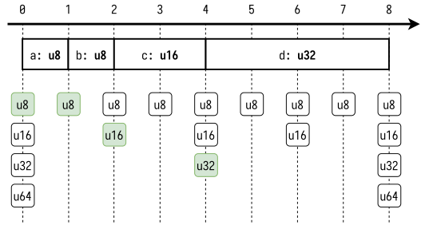

底部的小方块表示如果我们想要存该类型, 可以把它放在那里.

顶部部分表示实际的内存布局, 举个例子, 一个结构体:

```c
#include <stdint.h>
#include <stdio.h>
#include <stddef.h>

struct S {
    uint8_t a;
    uint8_t b;
    uint16_t c;
    uint32_t d;
};

int main() {
    printf("sizeof(S) = %ld\n", sizeof(struct S));
    printf("offsetof(struct S, a) = %zu\n", offsetof(struct S, a));
    printf("offsetof(struct S, b) = %zu\n", offsetof(struct S, b));
    printf("offsetof(struct S, c) = %zu\n", offsetof(struct S, c));
    printf("offsetof(struct S, d) = %zu\n", offsetof(struct S, d));
}
```

```shell
$ clang -Wall main.c -o main && ./main
sizeof(S) = 8
offsetof(struct S, a) = 0
offsetof(struct S, b) = 1
offsetof(struct S, c) = 2
offsetof(struct S, d) = 4
```

在这里, 一切顺利.

我们用另一个布局代替看看:

```c
struct S {
    uint8_t a;
    uint16_t b;
    uint8_t c;
    uint32_t d;
};
```

```shell
$ clang -Wall main.c -o main && ./main
sizeof(S) = 12
offsetof(struct S, a) = 0
offsetof(struct S, b) = 2
offsetof(struct S, c) = 4
offsetof(struct S, d) = 8
```

为了维持对齐, 编译器插入了废料:

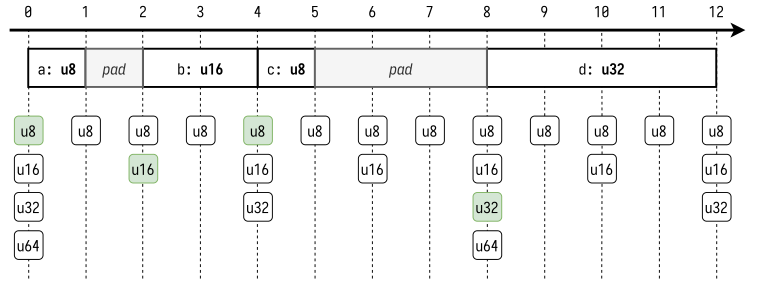

"Padding" 不绝对是置零 - 它只是没有使用的空间. 即使它初始化置零了, 也不能保证它会在你分配成员的时候维持0.

经常使用该结构体可能会混淆值和填充的 `padding`, 因此一个好的 `old block memory comparison` (memcmp) 不能够测试两个结构体是否完全相等.
> 原文: Regular usage of the struct might mess with the values in the padding, and so a good old block memory comparison (memcmp) would not be enough to test two structs for equality.

> 译者: 这里没懂作者想说什么, 有人清楚的话可以提个issue给我.

我们在 `Rust` 中定义一个相同布局的结构体会发生什么?

```rust
fn main() {
    struct S {
        a: u8,
        b: u16,
        c: u8,
        d: u32,
    }

    dbg!(std::mem::size_of::<S>());
}
```

```shell
$ cargo run -q
[src/main.rs:112] std::mem::size_of::<S>() = 8
```

为什么只有8个字节? 发生了什么? 让我们来借助工具看看它的布局:

```shell
$ cargo add memoffset
      Adding memoffset v0.5.5 to dependencies
```

```rust
fn main() {
    struct S {
        a: u8,
        b: u16,
        c: u8,
        d: u32,
    }

    use memoffset::offset_of;
    dbg!(
        std::mem::size_of::<S>(),
        offset_of!(S, a),
        offset_of!(S, b),
        offset_of!(S, c),
        offset_of!(S, d)
    );
}
```

```shell
$ cargo run -q
[src/main.rs:113] std::mem::size_of::<S>() = 8
[src/main.rs:113] offset_of!(S, a) = 6
[src/main.rs:113] offset_of!(S, b) = 4
[src/main.rs:113] offset_of!(S, c) = 7
[src/main.rs:113] offset_of!(S, d) = 0
```

我们的成员被重新排序了!

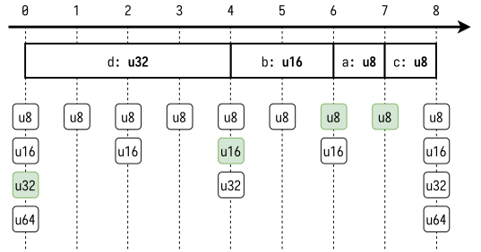

我们可以让 `Rust compiler` 不要重排序就像 `C` 一样通过 `repr(C)`:

```rust
fn main() {
    #[repr(C)]
    struct S {
        a: u8,
        b: u16,
        c: u8,
        d: u32,
    }

    use memoffset::offset_of;
    dbg!(
        std::mem::size_of::<S>(),
        offset_of!(S, a),
        offset_of!(S, b),
        offset_of!(S, c),
        offset_of!(S, d)
    );
}
```

```shell
cargo run -q
[src/main.rs:11] std::mem::size_of::<S>() = 12
[src/main.rs:11] offset_of!(S, a) = 0
[src/main.rs:11] offset_of!(S, b) = 2
[src/main.rs:11] offset_of!(S, c) = 4
[src/main.rs:11] offset_of!(S, d) = 8
```

现在我们有了和 `C` 一样的布局了, 也有着相同的填充.


或者也可以让编译器既不要重新排序也不要填充以完全忽略对齐:

```rust
fn main() {
    #[repr(C, packed)]
    struct S {
        a: u8,
        b: u16,
        c: u8,
        d: u32,
    }

    use memoffset::offset_of;
    dbg!(
        std::mem::size_of::<S>(),
        offset_of!(S, a),
        offset_of!(S, b),
        offset_of!(S, c),
        offset_of!(S, d)
    );
}
```

现在, `S.b` 不再很好地对齐了.

```shell
$ cargo run -q
[src/main.rs:11] std::mem::size_of::<S>() = 8
[src/main.rs:11] offset_of!(S, a) = 0
[src/main.rs:11] offset_of!(S, b) = 1
[src/main.rs:11] offset_of!(S, c) = 3
[src/main.rs:11] offset_of!(S, d) = 4
```

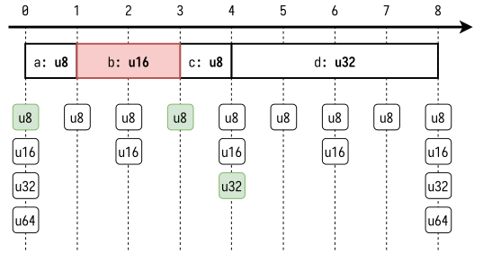

假如我们尝试获取一个引用, `Rust` 会警告我们(当前只是 `warn`, 以后可能会变成一个 `error`):

```rust
fn main() {
    #[repr(C, packed)]
    #[derive(Default)]
    struct S {
        a: u8,
        b: u16,
        c: u8,
        d: u32,
    }

    let s: S = Default::default();
    dbg!(&s.b);
}
```

```shell
$ cargo run -q
warning: borrow of packed field is unsafe and requires unsafe function or block (error E0133)
  --> src/main.rs:12:10
   |
12 |     dbg!(&s.b);
   |          ^^^^
   |
   = note: `#[warn(safe_packed_borrows)]` on by default
   = warning: this was previously accepted by the compiler but is being phased out; it will become a hard error in a future release!
   = note: for more information, see issue #46043 <https://github.com/rust-lang/rust/issues/46043>
   = note: fields of packed structs might be misaligned: dereferencing a misaligned pointer or even just creating a misaligned reference is undefined behavior

warning: 1 warning emitted

[src/main.rs:12] &s.b = 0
```

迄今... 所有的事情在我 `2018 i7` 处理器上工作得很好.

我们可以改变它也没有任何问题:

```rust
fn main() {
    #[repr(C, packed)]
    #[derive(Default)]
    struct S {
        a: u8,
        b: u16,
        c: u8,
        d: u32,
    }

    let mut s: S = Default::default();
    unsafe {
        s.b = 0x123;
        println!("{:#x}", s.b);
    }
}
```

```shell
$ cargo run -q
0x123
```

这并不是获得未对齐指针的唯一方法, 使用指针类型转换我们也可以把两个 `u8` 当作一个单独的未对齐的 `u16`.

```rust
fn main() {
    let mut arr = [1u8, 2u8, 3u8];
    let ptr_u16 = (&mut arr[1]) as *mut _ as *mut u16;

    unsafe {
        *ptr_u16 = 0x123;
        println!("{:#x}", *ptr_u16);
    }
}
```

注意, `clippy` 会捕获到这个, 并且认为这是一个错误.

```shell
$ cargo clippy
    Checking enumpeek v0.1.0 (/home/amos/ftl/enumpeek)
error: casting from `*mut u8` to a more-strictly-aligned pointer (`*mut u16`) (1 < 2 bytes)
 --> src/main.rs:3:19
  |
3 |     let ptr_u16 = (&mut arr[1]) as *mut _ as *mut u16;
  |                   ^^^^^^^^^^^^^^^^^^^^^^^^^^^^^^^^^^^
  |
  = note: `#[deny(clippy::cast_ptr_alignment)]` on by default
  = help: for further information visit https://rust-lang.github.io/rust-clippy/master/index.html#cast_ptr_alignment
```

不过这在我的电脑上依旧是可以运行的:

```shell
$ cargo run -q
0x123
```

所以为什么我们要再次关注对齐呢?

好吧, 这是一个很长的故事...

## 我们想要什么? 对齐! 我们为什么要它? Well...

回到 `C` 发明的年代, 那个时候有些处理器不怎么支持没有对齐过的内存访问.

对于这些处理器, 没有对齐的内存访问可能会导致[抛出一个处理器错误](https://www.kernel.org/doc/Documentation/unaligned-memory-access.txt): 异常处理器或许能够正常访问一个没有对齐的内存, 但是会浪费较多的性能, 或者是干脆没法访问未对齐的内存, 然后程序运行就被 abort 了.

在另一些处理器架构里, 像是英特尔的 "Core 2" 系列, 通常会用一些性能损耗来支持未对齐的内存.

我本来想在这里放上一些 microbenchmarks, 但是它们有时候会互相矛盾 - 基准测试有很多影响因素. 有些基准测试显示有 10% 的性能降低, 有些会降低 50%, 显然有很多会影响到关于访问未对齐内存的性能测试.

但是请记住, 即使处理器开始对未对齐内存做了一级支持, 但是出于性能原因仍然要避免使用未对齐内存.

我通常把最好的东西留到最后说 但是:

一些架构可能不会抛出处理器异常, 而是静默地执行一些不同的读操作.


<div class="dialog">
    
    <div class="dialog-text">
        <p>等等, 它会执行不同的读操作?</p>
    </div>
</div>

<div class="dialog amos">
    
    <div class="dialog-text">
        <p>是的.</p>
    </div>
</div>

<div class="dialog">
    
    <div class="dialog-text">
        <p>听起来很恐怖, 真的会发生吗? 你可以证实它吗?</p>
    </div>
</div>

<div class="dialog amos">
    
    <div class="dialog-text">
        <p>我会的.</p>
    </div>
</div>

## 很久很久, 在ARMv5以前...

我们已经在这篇文章里读了一些关于未对齐内存的内容.

所以展示上面所说的不同的读操作会相对比较容易.

首先你需要一些数据 - 我们只用了 8 个不同的字节值, 这很容易理解后面将会发生什么.

```c
	uint8_t arr[8] = { 0xef, 0xcd, 0xab, 0x89, 0x67, 0x45, 0x23, 0x01 };
```

然后我们去读一个没有对齐的地址. 举个例子, 我们尝试从数组的第二个元素开始读取一个 `uint32_t`.

```c
#include <stdint.h>
#include <stdio.h>

int main() {
    uint8_t arr[8] = {0xef, 0xcd, 0xab, 0x89, 0x67, 0x45, 0x23, 0x01};
    // arrays are zero-indexed, so `1` is the second item
    uint32_t *ptr = (uint32_t *)(&arr[1]);
    printf("0x%08x\n", *ptr);
    return 0;
}
```

猜猜会打印什么? 是 `0xcdab8967`? 错了!

我2018年的i7处理器是一个小端处理器:
```shell
$ lscpu | grep -E '(Byte Order|Model name)'
Byte Order:                      Little Endian
Model name:                      Intel(R) Core(TM) i7-8750H CPU @ 2.20GHz
```

这意味着字节是从最低有效值存储到最高有效值.

所以与其说是这样子的:

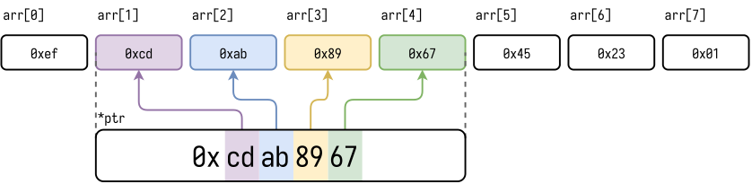

其实是这样子的:

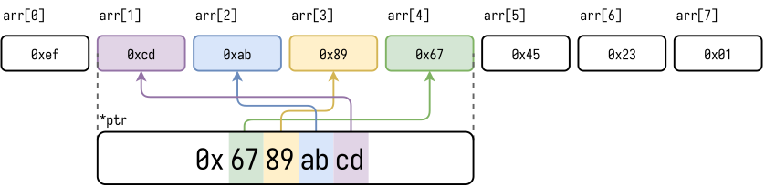

```shell
$ gcc -Wall main.c -o main && ./main
0x6789abcd
```

这就是为什么我为我的数组选了这些好辨识的值的原因.

<div class="dialog">
    
    <div class="dialog-text">
        <p>好吧, 我仍然无法相信你 - 因为这些没有对齐的数据看起来工作的很好.</p>
    </div>
</div>

<div class="dialog amos">
    
    <div class="dialog-text">
        <p>Yes, yes. 但是如果你在GBA上跑这些数据?</p>
    </div>
</div>


<div class="dialog amos">
    
    <div class="dialog-text">
        <p>The Game Boy Advance has a 16.8 MHz 32-bit ARM7TDMI processor - which implements the ARMv4T micro-architecture?</p>
    </div>
</div>

<div class="dialog">
    
    <div class="dialog-text">
        <p>行行行, 那这意味着什么呢?</p>
    </div>
</div>

<div class="dialog amos">
    
    <div class="dialog-text">
        <p>它意味着我们回到了2001.</p>
    </div>
</div>

<div class="dialog">
    
    <div class="dialog-text">
        <p>行, 我很好奇 - 我们怎么在2020年给GBA编译?</p>
    </div>
</div>

<div class="dialog amos">
    
    <div class="dialog-text">
        <p>It's simple! Just install devKitPro on your OS of choice, and, uh, read a bit lot of documentation, and you're good to go!</p>
    </div>
</div>

| [devKitPro](https://devkitpro.org/wiki/Getting_Started)

<div class="dialog">
    
    <div class="dialog-text">
        <p>我以前是不是看你尝试过一个AS-1100虚拟机？ 然后是SH4?</p>
    </div>
</div>

<div class="dialog amos">
    
    <div class="dialog-text">
        <p>Yeah well, hindsight is 20/20(大概是事后诸葛亮的意思). Do you want to see something cool or not?</p>
    </div>
</div>

<div class="dialog">
    
    <div class="dialog-text">
        <p>继续吧继续吧!</p>
    </div>
</div>

我以前也没读过关于GBA开发的相关文档, 我只是找了个项目[VisualBoyAdvance](https://vba-m.com/):

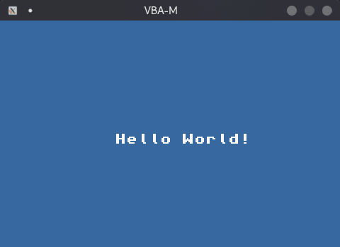

这个项目的 `C` 代码看起来如下:

```c
    // (cut)

    // clear screen
    iprintf("\x1b[2J");
    // print at coordinates 10,10
    iprintf("\x1b[10;10H");

    iprintf("Hello World!");

    // (cut)
```

So - 足够简单了!他有一些自己的 `printf` 实现 - 除此之外, 这就只是 `C`! 然后同样用 `GCC` 编译.

所以让我们的代码跑起来并不是**很难**.

以下是完整的代码 `source/console.c`:

```c
#include <gba_console.h>
#include <gba_video.h>
#include <gba_interrupt.h>
#include <gba_systemcalls.h>

int main(void) {
    irqInit();
    irqEnable(IRQ_VBLANK);

    consoleDemoInit();

    // clear screen
    iprintf("\x1b[2J");
    // print at coordinates 10,10
    iprintf("\x1b[10;10H");

    uint8_t arr[8] = {0xef, 0xcd, 0xab, 0x89, 0x67, 0x45, 0x23, 0x01};
    // arrays are zero-indexed, so `1` is the second item
    uint32_t *ptr = (uint32_t *)(&arr[1]);
    iprintf("0x%08x", *ptr);

    while (1) {
        VBlankIntrWait();
    }
}
```